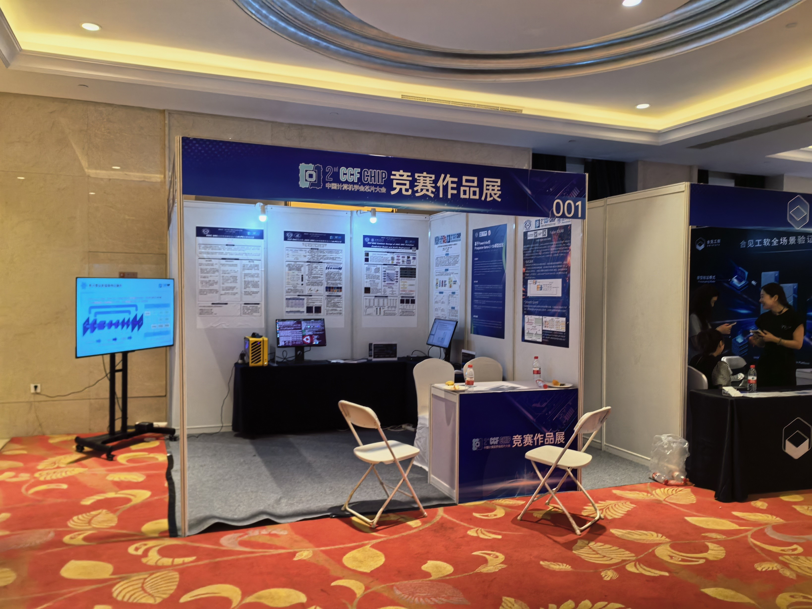
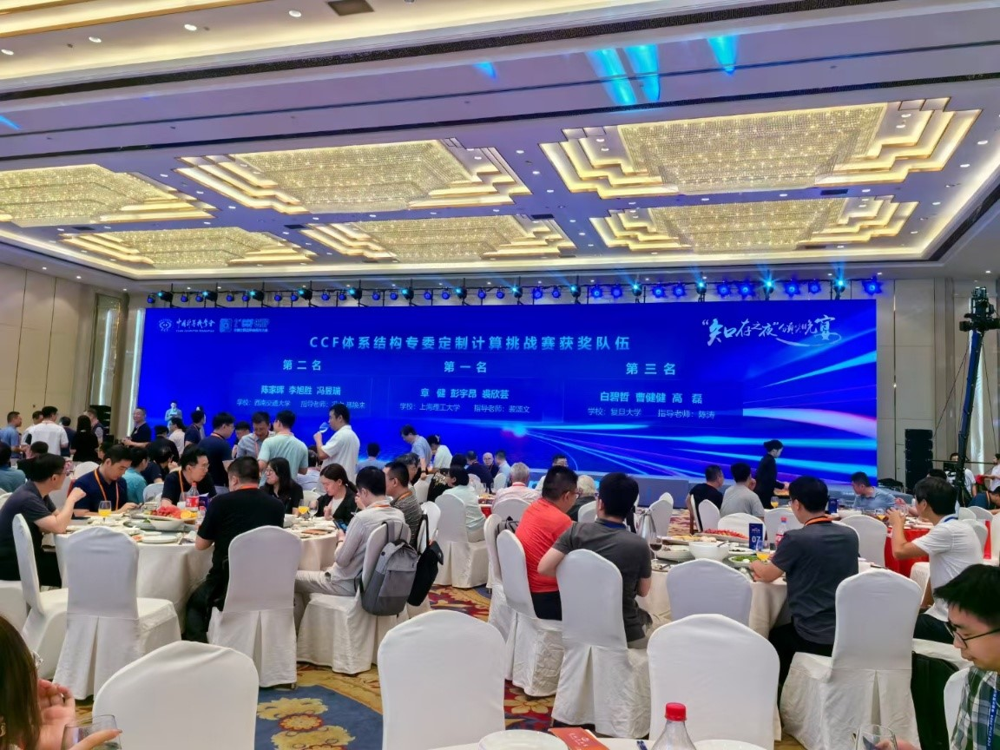

## Final Results

| 排名 | 学校                                  | 队员1（队长） | 队员2  | 队员3  | 指导教师1 | 指导教师2 |
| ---- | ------------------------------------- | ------------- | ------ | ------ | --------- | --------- |
| 1    | 上海理工大学(USST)                    | 章健          | 彭宇昂 | 裘欣芸 | 裴颂文    |           |
| 2    | 西南交通大学(SWJTU)                   | 李旭胜        | 陈家晖 | 冯昱瑞 | 冯立      | 邢焕来    |
| 3    | 复旦大学(FDU)                         | 白碧哲        | 曹健健 | 高磊   | 陈涛      |           |
| 4    | 中国科学院大学/之江实验室(UCAS/ZJlab) | 徐浩然        | 杜建华 | 柳文博 | 张汝云    |           |
| 5    | 北京工业大学(BIT)                     | 吴灵杰        | 王正涛 | 刘一祺 | 张文博    |           |
| 6    | 西南交通大学(SWJTU)                   | 明刚          | 刘宸诚 | 李嘉煜 | 朱宗海    | 陈香伊    |

## Finals on-site

竞赛作品分享展台

颁奖现场

